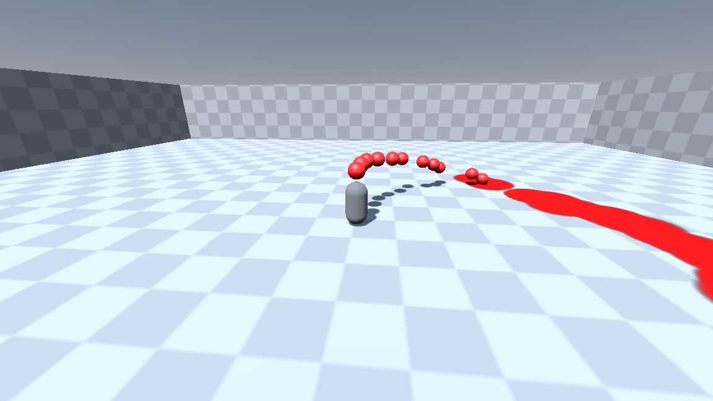

## Splatoon-like splatmap paint mechanic in Godot 4.4

### Most of the code is from Crigz Vs Game Dev
https://youtu.be/4DFpLnEnKFk?si=aB63z6VvFdbTNyw7
  
  
### Special thanks to Alfred Baudisch
For figuring out splatmap texturing using Godot  
https://alfredbaudisch.com/blog/gamedev/godot-engine/godot-engine-in-game-splat-map-texture-painting-dirt-removal-effect/
  
  
### TODO:
- Add score count
- Better documentation
- Create a level
- Clean up code (a bunch)
