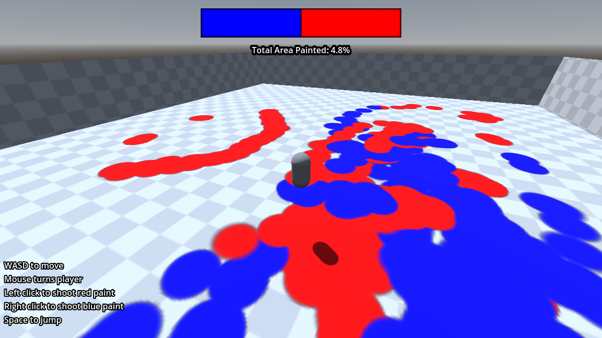

### Splatoon-like splatmap texture paint mechanic using Godot 4.4
  

  
### Most of the code is from Crigz Vs Game Dev
https://youtu.be/4DFpLnEnKFk?si=aB63z6VvFdbTNyw7  
https://www.youtube.com/@crigz  
(go subscribe!)
  
  
### Special thanks to Alfred Baudisch
For figuring out splatmap texturing using Godot  
https://alfredbaudisch.com/blog/gamedev/godot-engine/godot-engine-in-game-splat-map-texture-painting-dirt-removal-effect/
